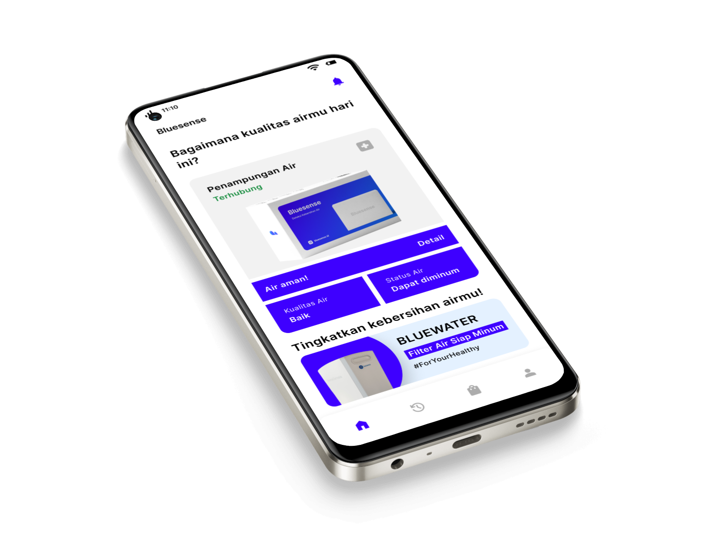
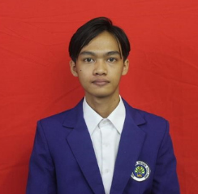
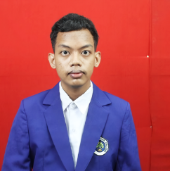
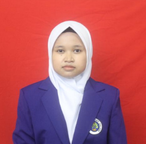

<h1>Bluesense</h1>

Supporting Sustainable Development Goals, particularly in clean water and sanitation.

## Overview

Bluesense present to support sustainable development goals, particularly in clean water and sanitation.

This Application also provides services for monitoring water quality, so that people or user get full access to water quality and avoid using unsuitable water.
In addiction, there are also features that will help users get access to clean water trough the use of water filters and water providers

## Vision

Being a pioneer in creating innovative solutions to monitor water quality efficiently and provide easy access to users to get safe clean water through aupplier recommendations and advanced water filter technology.

Develop leading-edge technologies that enable real time monitoring of water quality with high accuracy, ensuring the safety and cleanliness of water used by communities.

Build close collaboration with water suppliers and water filter manufacturers to ensure users get the optimal solution according to their specific needs.

## Meet our amazing team

    

        
        <h3>Septa Alfauzan</h3>
        <h3>Hacker 1</h3>
    

    

    
        <h3>Roni Ragil Iman Khoirul</h3>
        <h3>Hacker 2</h3>
    

    

    
        <h3>Janualita Yanabilah</h3>
        <h3>Hipster</h3>
    

    

    
        <h3>Siti Imro</h3>
        <h3>Hustler</h3>
    

